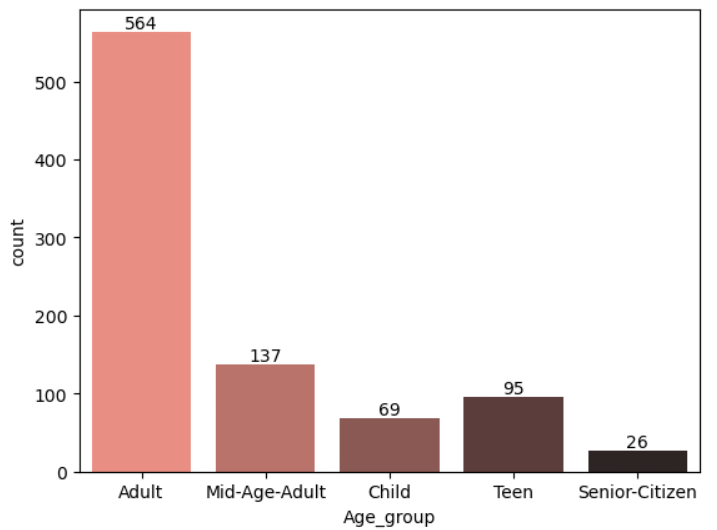
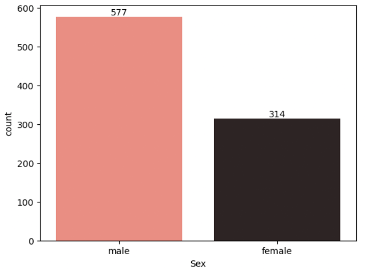
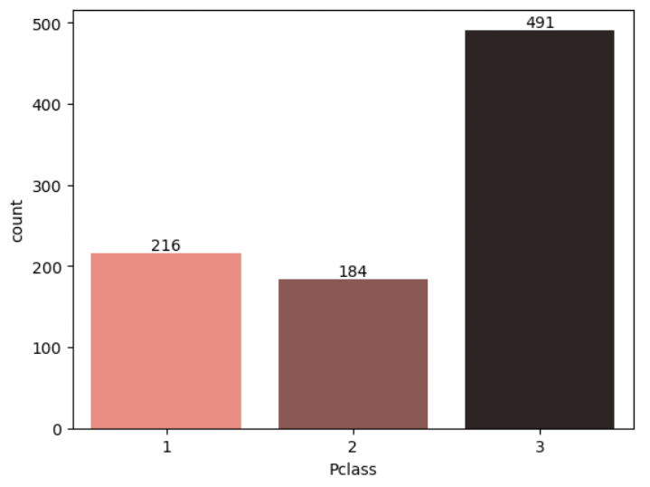
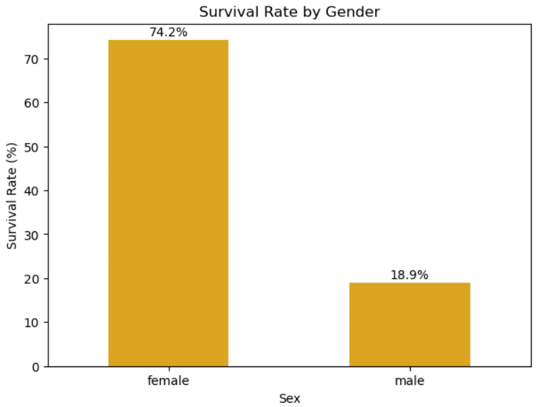

# Titanic-Survival-Analysis
Analyzing Titanic passenger data to figure out what actually affected someone's chances of survival — things like gender, class, age, and family size.


## Contents
- [Introduction](#introduction)
- [Tools Used](#tools-used)
- [Dataset](#dataset)
- [Importing Libraries & Loading the Dataset](#importing-libraries--loading-the-dataset)
- [Data Understanding](#data-understanding)
- [Data Cleaning](#data-cleaning)
- [Feature Engineering](#feature-engineering)
- [Exploratory Analysis](#exploratory-analysis)
- [Survival Analysis](#survival-analysis)
- [Survival Rate Breakdown](#survival-rate-breakdown)
- [Key Findings](#key-findings)
- [Conclusion](#conclusion)
- [Future Improvements](#future-improvements)
## Introduction
The Titanic disaster is one of those events everyone's heard of, and the passenger data is a good excuse to dig into what really decided who survived and who didn't.
For this project I went through the passenger details — class, gender, age, fare, family size, and so on — to see which of these actually mattered for survival. Started with cleaning up the raw data, added a few new features that made more sense to work with, explored the dataset a bit, and then got into the actual survival patterns.
If you spot something I could do better, feel free to open an issue.

## Tools Used
- **Language:** Python
- **Libraries:** Pandas, NumPy, Matplotlib, Seaborn
- **Environment:** Jupyter Notebook

## Dataset
Used the classic Titanic passenger dataset here — 891 records, 11 columns, including class, gender, age, fare, and whether the passenger survived.

## Importing Libraries & Loading the Dataset
First step was just getting the libraries in and loading the data.
```python
import numpy as np
import pandas as pd
import matplotlib.pyplot as plt
import seaborn as sns
import warnings
warnings.filterwarnings("ignore")

df = pd.read_csv("titanic.csv")
df
```

## Data Understanding
Quick rundown of what's in the dataset:

| Attribute | Description |
|---|---|
| Survived | Target variable — 0 = Did not survive, 1 = Survived |
| Pclass | Passenger class (1st, 2nd, 3rd) |
| Sex | Gender |
| Age | Passenger age |
| SibSp | Number of siblings/spouses aboard |
| Parch | Number of parents/children aboard |
| Fare | Ticket fare |
| Embarked | Port of embarkation (Southampton, Cherbourg, Queenstown) |
| Cabin | Cabin number (mostly missing) |
| Name | Passenger name |
| Ticket | Ticket number |

## Data Cleaning
A few columns had missing data that needed sorting out before I could do anything useful with it:
```python
df.isna().sum()

# Age had about 20% missing — used median instead of mean since age can have outliers
df['Age'] = df['Age'].fillna(df['Age'].median())

# Only 2 missing values in Embarked which is a categorical data, so just filled with the most common port (mode)
df['Embarked'] = df['Embarked'].fillna(df['Embarked'].mode()[0])

# Cabin was missing for ~77% of passengers — too much to fill reliably,
# so instead I just tracked whether cabin info existed at all, then dropped the column
df['Has_Cabin'] = df['Cabin'].notna().astype(int)
df = df.drop(columns=['Cabin'])

df.isna().sum()
```

## Feature Engineering
Added a few new columns to make the analysis easier to work with:
```python
# Age groups
df.loc[df["Age"]<=12, "Age_group"] = "Child"
df.loc[(df["Age"]>12) & (df["Age"]<=19), "Age_group"] = "Teen"
df.loc[(df["Age"]>19) & (df["Age"]<=39), "Age_group"] = "Adult"
df.loc[(df["Age"]>39) & (df["Age"]<=59), "Age_group"] = "Mid-Age-Adult"
df.loc[df["Age"]>59, "Age_group"] = "Senior-Citizen"

# Family size = siblings/spouses + parents/children + self
df['Family_Size'] = df['SibSp'] + df['Parch'] + 1

# Pulled the title out of the Name column (Mr, Mrs, Miss, Master, etc.)
df['Title'] = df['Name'].str.extract(r',\s*([^\.]*)\.')

# Cleaned up French equivalents and grouped the rare ones together
df['Title'] = df['Title'].replace({'Mlle': 'Miss', 'Ms': 'Miss', 'Mme': 'Mrs'})
rare_titles = ['Dr', 'Rev', 'Major', 'Col', 'the Countess', 'Capt', 'Sir', 'Lady', 'Don', 'Jonkheer']
df['Title'] = df['Title'].replace(rare_titles, 'Other')

df['Title'].value_counts()
```

## Exploratory Analysis
Before getting into survival, I wanted to just look at the overall shape of the data — how gender, class, age groups, and a few other things were distributed.

```python
def count_plot(b):
    sell = sns.countplot(x=b, palette='dark:salmon_r')
    for container in sell.containers:
        sell.bar_label(container)
count_plot(df['Sex'])
count_plot(df['Pclass'])
count_plot(df['Age_group'])
count_plot(df['Embarked'])
count_plot(df['Title'])

plt.figure(figsize=(8,5))
sns.histplot(df['Fare'], kde=True, color='salmon')
plt.xlabel("Fare")
plt.ylabel("Frequency")
plt.show()

plt.figure(figsize=(8,5))
sns.histplot(df['Family_Size'], kde=True, color='salmon')
plt.xlabel("Family Size")
plt.ylabel("Frequency")
plt.show()
```


## Survival Analysis
This was the main part — checking how each factor actually related to survival:
- Gender vs. survival
- Passenger class vs. survival
- Age group vs. survival
- Title vs. survival
- Cabin info availability vs. survival
- Family size vs. survival

```python
def count_plot(a):
    xyz = sns.countplot(x=a, hue=df['Survived'], palette="dark:salmon_r")
    for container in xyz.containers:
        xyz.bar_label(container)
count_plot(df['Sex'])
count_plot(df['Pclass'])
count_plot(df['Age_group'])
count_plot(df['Embarked'])
count_plot(df['Title'])
count_plot(df['Has_Cabin'])
count_plot(df['Family_Size'])
```



## Survival Rate Breakdown
Raw counts don't tell the full picture on their own, so I worked out the actual survival rate (%) for each category to see how big a difference each factor really made.

```python
def survival_rate_plot(col, title):
    rate = df.groupby(col)['Survived'].mean().sort_values(ascending=False) * 100
    plt.figure(figsize=(7,5))
    ax = sns.barplot(x=rate.index, y=rate.values, hue=rate.index, palette='crest', legend=False)
    ax.set_ylabel("Survival Rate (%)")
    ax.set_title(title)
    for i, v in enumerate(rate.values):
        ax.text(i, v + 1, f"{v:.1f}%", ha='center')
    plt.xticks(rotation=0)
    plt.show()

survival_rate_plot('Sex', 'Survival Rate by Gender')
survival_rate_plot('Pclass', 'Survival Rate by Passenger Class')
survival_rate_plot('Age_group', 'Survival Rate by Age Group')
survival_rate_plot('Title', 'Survival Rate by Title')
survival_rate_plot('Has_Cabin', 'Survival Rate by Cabin Info Availability')
```


## Key Findings
- Gender made the biggest difference by far — women survived at around 74%, men at just 19%. Matches the whole "women and children first" thing pretty closely.
- Survival rate dropped steadily by class: 63% for 1st class, 47% for 2nd, and only 24% for 3rd.
- Children had the best survival rate of any age group (58%), while senior citizens had the worst (27%).
- Even within men, age mattered — young boys ("Master") survived at 58%, compared to just 16% for adult men ("Mr").
- Passengers with cabin info on record (probably wealthier passengers) survived at more than double the rate of those without (67% vs 30%).
- Traveling alone hurt your odds (30% survival), while small families of 3-4 did the best (70%+). Very large families saw survival drop again.

## Conclusion
Survival on the Titanic wasn't random at all — gender, class, and age all played a big role. 
Women and children had noticeably better odds than men, and passengers in higher classes fared better than those in 3rd class. Family size mattered too — small    groups did better than people traveling completely alone or in very large families. 
Overall, it's a pretty clear picture of how social and demographic factors shaped who made it and who didn't.

## Future Improvements
- Try building some ML models to actually predict survival instead of just analyzing patterns.
- Compare a few different algorithms (Logistic Regression, Random Forest, etc.) and see what works best.
- Handle Age imputation a bit better — maybe fill it based on Title or Pclass instead of just using one overall median.
- Look into feature scaling and encoding so the data's ready for modeling.
- Check model performance properly using accuracy, precision, recall, and a confusion matrix.
